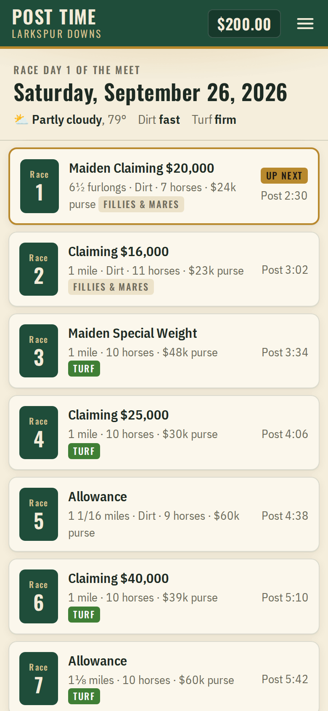
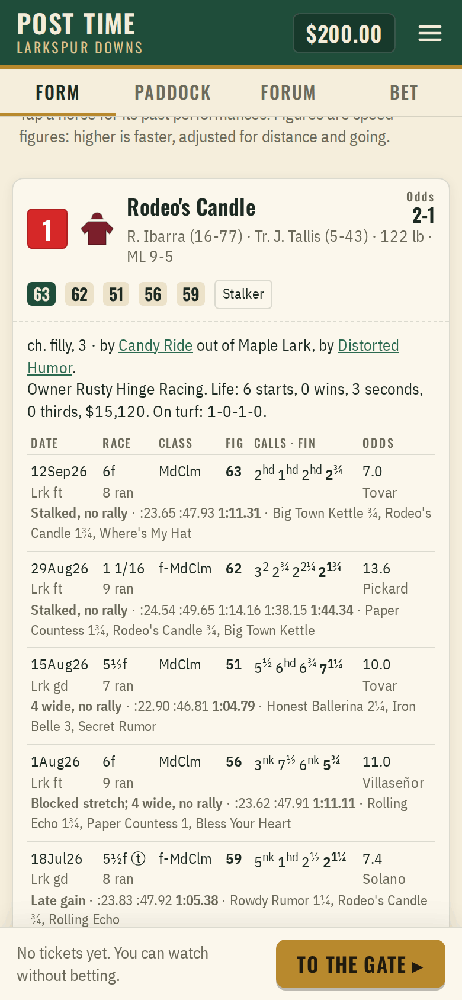
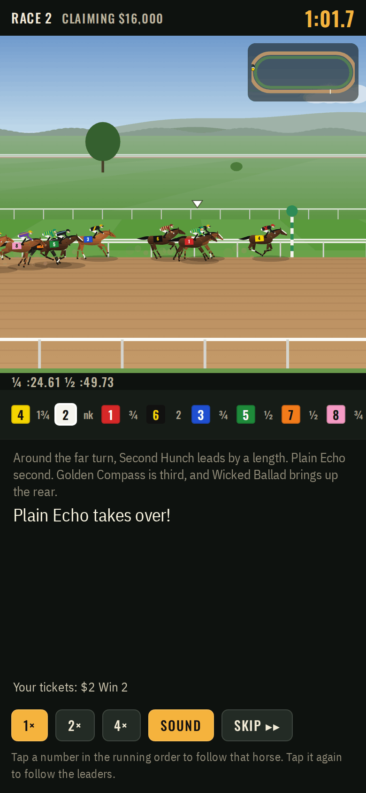
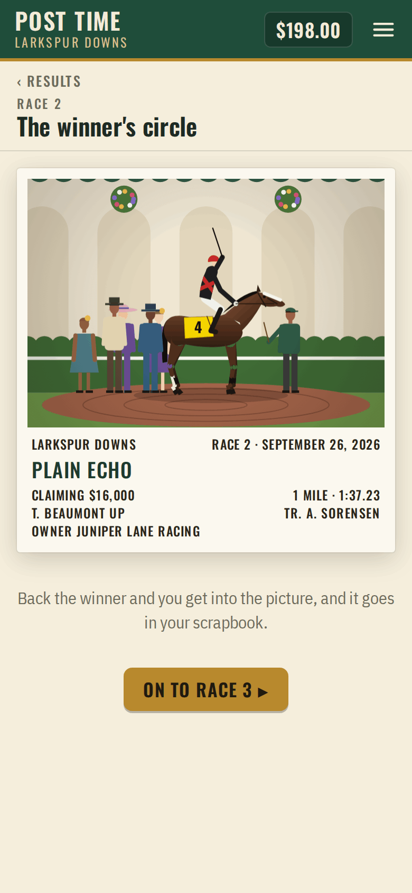

# Post Time

**Play it: [post-time.junkdrawer.works](https://post-time.junkdrawer.works/)**

**A day at the races at Larkspur Downs, a made-up track with eight races every Saturday.** Read the form, look the horses over in the paddock, see who the regulars on the forum like, and buy tickets at the window while the odds move. Then watch the race from the gate to the wire, with a caller, a running order and, when it's close, a photo finish. Your bankroll and the horses carry over from one race day to the next.

<p align="center">
  
  &nbsp;
  
  &nbsp;
  
  &nbsp;
  
</p>

## How it plays

- **The form is real.** The meet starts with ten weeks of races already run, simulated the same way as the ones you watch. Every speed figure, running line, trip comment and workout in a horse's past performances happened.
- **The race.** Each horse has a speed it can keep up all race and a reserve of extra it can spend above that, and going fast costs far more than going a little faster. So speed horses who duel for the lead tire each other out, and a lone speed horse left alone up front often wins. Horses save ground on the rail, lose it going wide on the turns, get stuck behind tiring horses and swing out to find room.
- **Handicapping angles.** First time on turf, cutting back in distance, dropping in class, a new barn after a claim, a bullet workout, a troubled trip last time. Sires carry real tendencies: some get horses that love grass, or mud, or a long way. Sire names link to [Bloodlines](https://junkdrawer.works/bloodlines/).
- **The paddock.** How a horse looks before the race says something about how it feels today, and "washed out" is bad news.
- **The forum.** Seven regulars, each with a system: speed figures, the favorite, pace, pedigree, longshots, the look of a horse in the paddock, and one who always bets the grey. Their records are kept, so you can see which of them to listen to. They have plenty to say after the race too.
- **The tote.** Win, place, show, across the board, exacta and trifecta, straight or boxed. Money goes into pari-mutuel pools, the track takes its cut, and the odds move as minutes to post tick down. The late money knows a little more than the early money.
- **Watching.** A camera beside the track follows the leaders, swinging round the turns so the grandstand and the hills sweep past. There's a running order with margins, fractions on the clock, a map of the oval, and the caller (the browser can read the call aloud if you ask it to). Tap a horse's number to follow it. Close finishes go to slow motion, then to a photo: a real slit-camera picture made from the recorded race, so the horses come out stretched and squashed the way finish photos do.
- **The winner's circle.** Back the winner and you're in the photograph, holding your ticket. It goes in your scrapbook.
- No account and no server. The racing world, your bankroll and your scrapbook stay in your browser. It works offline and installs to a phone's home screen.

## Running it

It's a static site: plain HTML, CSS and JavaScript, with no build step.

```sh
npx serve .                   # or any static file server, then open the printed address
npm test                      # checks the racing logic in Node, then plays a race in Chromium (needs Playwright)
npm install                   # once, for the screenshot tool's PNG compressor and the bundler
node tools/screenshots.mjs    # redraws docs/*.png and og.png
node tools/make-icons.mjs     # redraws the PNG icons from icon.svg
npm run build                 # bundles everything into dist/post-time.html, one file you can send around
```

To put it online with GitHub Pages: **Settings → Pages → Build and deployment → Deploy from a branch**, then pick `main` and `/ (root)`.

### Files

- `js/sim.js`: the race: pace, stamina, traffic and ground lost on the turns. Recorded frame by frame for playback.
- `js/track.js`: the one-mile dirt oval, the seven-furlong turf course inside it, chutes and distance poles.
- `js/world.js`: the barn of horses, the race cards, and turning a finished race into past performances.
- `js/handicap.js`, `js/forum.js`: what the public can see, the morning line, and the forum regulars' systems.
- `js/tote.js`: pari-mutuel pools, moving odds and payouts.
- `js/call.js`, `js/chart.js`: the race caller, trip comments and running lines.
- `js/draw/`: the horses and riders, the view from beside the track, the photo finish and the winner's circle.
- `js/ui/`, `js/game.js`, `js/app.js`: the screens, your bankroll and tickets, and saving.
- `js/audio.js`: the bugle, the starting bell, the crowd and the cash window, all synthesised.
- `fonts/`: Oswald and IBM Plex Sans Condensed (SIL Open Font License), served from here so nothing loads from elsewhere.
- `sw.js`: keeps a copy for playing offline.
- `test/sim.test.mjs`, `test/e2e.mjs`: the tests.
- `dev/`: pages that draw the horses, a race, the photo finish and the winner's circle on their own, for tuning by eye.
